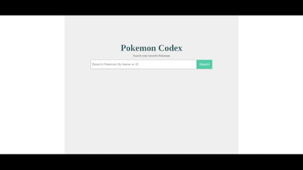

<div align="center">
	

<br/>

</div>

# Pokemon Codex Search :
In the "Pokemon Codex Search", you'll build a JavaScript application to search for a pokemons stats by Name or ID.


## Installation :

Clone the repo and launch the html file in the browser
```
git@github.com:Belal-Aljumaa/pokemon_codex.git
```

## Live Website :

💻 Check the live website from [here](https://belal-aljumaa.github.io/pokemon_codex/)


## Result :


## Used Technologies

<table>
  <tr>
    <td>
      
    </td>
    <td>
      
    </td>
    <td>
      
    </td>
  </tr>
</table>


## Credits & Assets
- The RESTful Pokémon API (http://pokeapi.co/).
